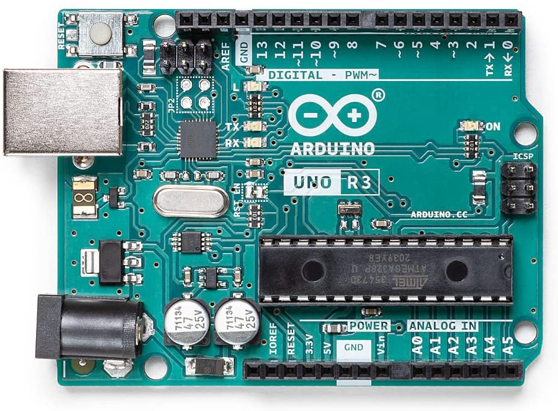
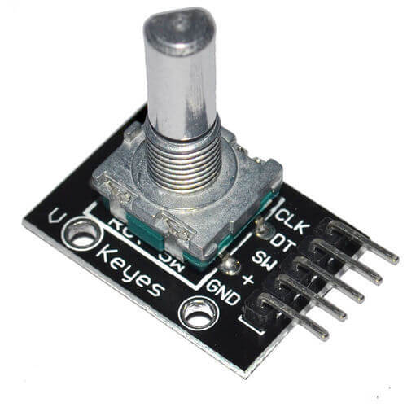
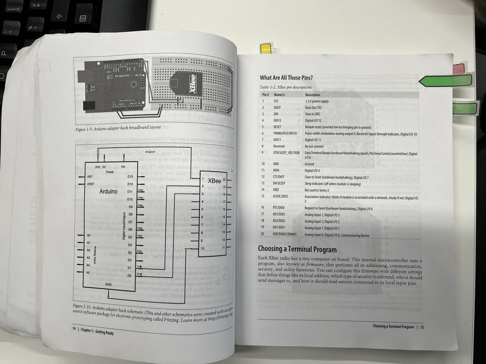

# Notes Ardunino

---

## Modèle utilisé

- 1x Arduino Uno

## fichier projet ok :
==> projet_ok

---

## Liens de téléchargement

- [Arduino IDE](https://www.arduino.cc/en/Guide)

## Lien de tutos

### 1 - [Découverte de l'Arduino](https://zestedesavoir.com/tutoriels/686/arduino-premiers-pas-en-informatique-embarquee/742_decouverte-de-larduino/3417_le-materiel/)

- [Notre premier programme !](https://zestedesavoir.com/tutoriels/686/arduino-premiers-pas-en-informatique-embarquee/743_gestion-des-entrees-sorties/3420_notre-premier-programme/)
- [Les entrées analogiques de l’Arduino](https://zestedesavoir.com/tutoriels/686/arduino-premiers-pas-en-informatique-embarquee/745_les-grandeurs-analogiques/3430_les-entrees-analogiques-de-larduino/#3-10726_lecture-analogique-on-y-vient)
- [Les capteurs et l'environnement autour d'Arduino](https://zestedesavoir.com/tutoriels/686/arduino-premiers-pas-en-informatique-embarquee/746_les-capteurs-et-lenvironnement-autour-darduino/)
- [Différents types de mesures](https://zestedesavoir.com/tutoriels/686/arduino-premiers-pas-en-informatique-embarquee/746_les-capteurs-et-lenvironnement-autour-darduino/3435_differents-types-de-mesures/)

### 2 - [Arduino - Potentionmètre](https://www.aranacorp.com/fr/utilisation-dun-encodeur-rotatif-avec-arduino/)

- [Lecture d’un potentiomètre. Entrées analogiques d’Arduino.](https://ledisrupteurdimensionnel.com/arduino/lecture-potentiometre-entrees-analogiques-arduino/)

### 3 - Arduino to XBEE : 

- [YB - Configure XBEE using Arduino in less than 5 mins No breakout boards used](https://www.youtube.com/watch?v=wtal7SWZek0)
- [YB - Arduino Tutorial - xBee modules as a Transmitter & Receiver](https://www.youtube.com/watch?v=Oslru54rA50)
- [YB - ARDUINO with XBEE- WIRELESS SETUP DEMO](https://www.youtube.com/watch?v=S0WTsiocpIs)
- [Arduino sans fil grâce aux modules Xbee](https://www.redohm.fr/2015/03/communication-xbee/)

### 4 - [Capteur de humidité](https://tutoduino.fr/debuter/capteur-temperature/)

#### debugg :

- error `avrdude: stk500_getsync() attempt 1 of 10: not in sync: resp=0x00` :
    - [recherche google](https://www.google.com/search?q=vrdude%3A+stk500_getsync()+attempt+1+of+10%3A+not+in+sync%3A+resp%3D0x00&rlz=1C5CHFA_enFR899FR899&oq=vrdude%3A+stk500_getsync()+attempt+1+of+10%3A+not+in+sync%3A+resp%3D0x00&aqs=chrome..69i57j69i58.98j0j7&sourceid=chrome&ie=UTF-8)
    - [stackExchange](https://arduino.stackexchange.com/questions/17/avrdude-stk500-getsync-not-in-sync-resp-0x00-aka-some-dude-named-avr-won)
    - [arduino forum](https://forum.arduino.cc/t/resolu-erreur-upload-avrdude-stk500_getsync/478307/2)
    - [Comment régler le problème Arduino avrdude: stk500 getsync() | Vlog Bricolage #1](https://www.youtube.com/watch?v=81K2oaXwu9Y)

    - [How to Use XBee Modules As Transmitter & Receiver - Arduino Tutorial](https://www.instructables.com/How-to-Use-XBee-Modules-As-Transmitter-Receiver-Ar/)
    - [XBee Module Interfacing with Arduino](https://circuitdigest.com/microcontroller-projects/arduino-xbee-module-interfacing-tutorial)

    - [Tutoriel d’introduction à Arduino XBee](https://www.cours-gratuit.com/cours-arduino/tutoriel-d-introduction-a-arduino-xbee)

NB : Port mac : `tty.usbmodem141201`